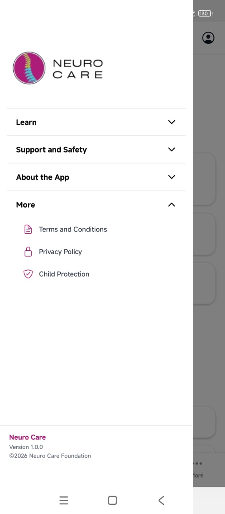

# Neuro Care App (Frontend)

Neuro Care App is a cross-platform mobile application designed to provide accessible neurological health information, resources and community support. The frontend focuses on delivering a clear, inclusive and reliable user experience across devices.

## Purpose

The application aims to support individuals affected by neurological conditions, caregivers and the wider community by:
- Presenting trusted neurological health information.
- Surfacing organizational programs, events and resources.
- Enabling guided assistance through an in-app AI assistant, termed Neuro.
- Supporting anonymous and authenticated user flows.

## Tech Stack

- React Native (Expo)
- TypeScript.
- Expo Router.
- Backend-driven navigation and configuration.
- Personalization.
- Internationalization and user preferences support.

## Architecture Overview

The frontend is built around **backend-authoritative contracts**, ensuring consistency and maintainability across the platform. Screens and navigation are derived from API responses rather than hardcoded assumptions.

Key principles:
- No screen exists without a corresponding backend contract.
- Navigation structure is stable and contract-driven.
- User identity supports both anonymous and authenticated states.
- Multi-language support is part of the core identity layer.

## Core Features

- Home screen driven by backend configuration.
- Community and support resources.
- Neuro Assistant (hybrid: general knowledge + organization data).
- Profile and preferences management.
- Safe-area aware, accessible UI patterns.

## Screenshots

### Drawer

### Home

### Community

### Neuro Assistant

## Status

This project is under active development and follows a phased implementation approach:
1. Backend contracts definition.
2. Navigation hierarchy.
3. UI wiring.
4. UX refinement.

## Related Repositories

- Backend API: [neurocare-backend](https://github.com/aogajoseph/neurocare-backend/)

---

Built with a focus on clarity, accessibility and long-term maintainability.
